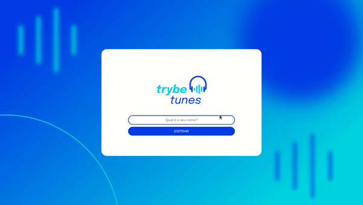

## Sobre

Trybetunes é um projeto desenvolvido durante o curso da Trybe, sendo o 4º do módulo de front-end. O objetivo era criar um app de músicas usando a API do iTunes.

## Tecnologias usadas

- React
- React Testing Library
- React Context
- CSS

## Como rodar o projeto

- Acesse https://daviazev-trybetunes.netlify.app/

- Ou instale usando o comando `git clone git@github.com:daviazev/trybetunes.git`

- Entre na pasta usando `cd trybetunes`

- Instale as dependências do projeto usando `npm install`

- Pronto! Você pode rodar usando o comando `npm start`
